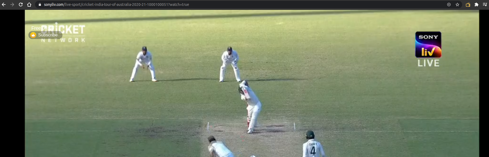
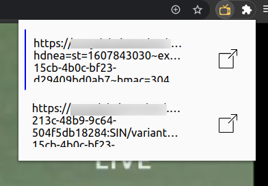
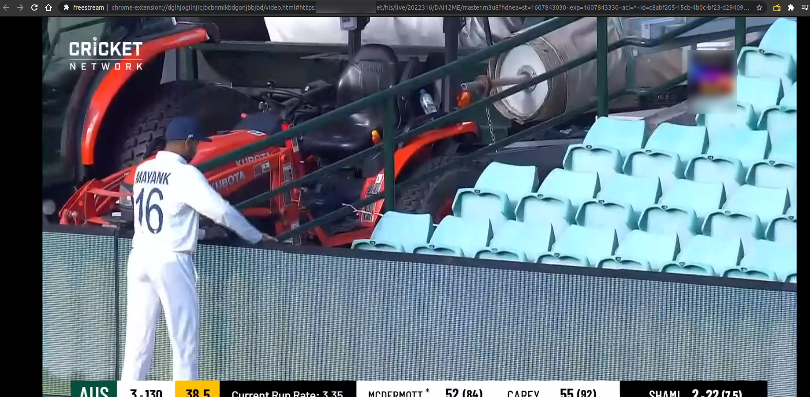

# freestream

Simple browser extension that searches a webpage for m3u8 links and helps them open in new builtin HLS player.

Most of streaming services use HLS format to stream their content. To display in browser the use HLS player, which is mostly built using [hls.js](https://github.com/video-dev/hls.js/) and over the player they add restrictive features like preview timer, ads etc.

Freestream catches the calls when streaming services are opened and stream them in its own player thus bypassing restrictive features.

## Usage

1) Open the streaming service.
   
2) Freestream will detect if the page uses HLS format and will turn yellow. Click on the extension. You will get a list of streams that are being rendered on the page. Open the appropriate stream. (Can be Hit and Trial)
   
3) Enjoy the streaming service in builtin Freestream player.
    